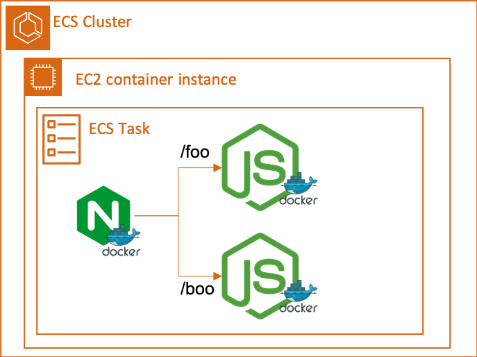

# Summary

This application demos how to dockerize a simple applicaion using docker compose and deploy it to AWS ECS.



### Run Application Locally

```
docker-compose up
```

### Deploy to AWS ECS

A series manual steps were taken as below (could be automated with CloudFormation):

1. Create a ECS cluster
2. Create 2 ECR repository
3. Build docker image (`docker-compose build`) and push (`docker-compose push`) to ECR
4. Create a ECS task definition
